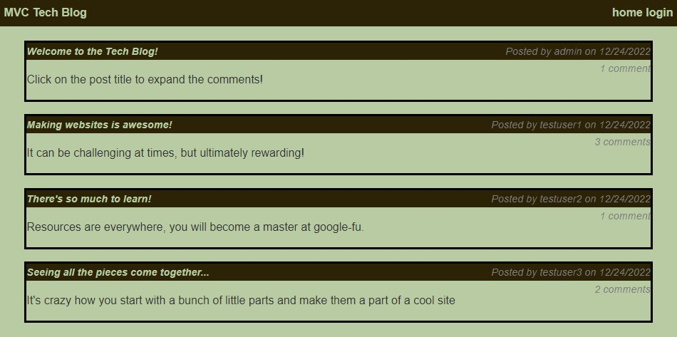
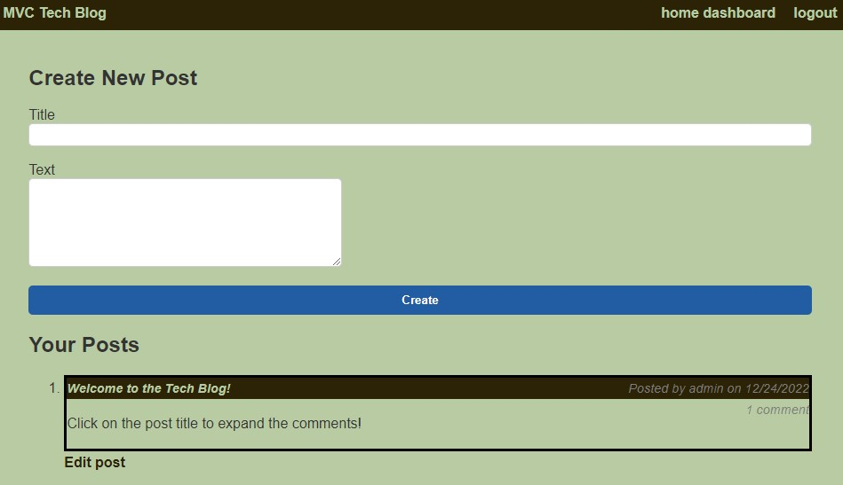

# techblog
# Solution for Module 14 Challenge

An interactive message board allowing for users to view posts and comments.  If the user chooses, they can create an account and make their own posts, as well as commenting on others.
  

[Link to Live Site](https://murmuring-mountain-63633.herokuapp.com/)  
[Link to GitHub Repo](https://github.com/fryylord/techblog)  

- [Installation](#installation)
- [Usage](#usage)
- [Credits](#credits)
- [License](#license)

## Installation

There is no installation necessary to use the existing server, the program is functional upon arriving at the landing page.  

It can be run locally, if the user clones the repository from github to the local machine.
After navigating to the clone repository in the command line, run npm install to install all dependencies. To use the application locally, run node server.js in your CLI, and then open http://localhost:3001 in your preferred browser.

## Usage

The website has multiple functions.  An unregistered user arrives at the landing page and can view existing posts and their related contents.
If the user wishes they can log in using the link in the menu bar.  Upon arriving at the log in page, the user can log in or register to create an account.
After logging in the user is presented with a dashboard allowing to create a new post, as well as a record of their previous posts.
The user can return to the main board as well, and now when they view posts, they have the ability to comment.
The user will stay logged in for a period of time, after which they will be automatically signed out if there is no activity.  

## Credits

https://ku.bootcampcontent.com/ku-coding-boot-camp/KU-VIRT-FSF-PT-09-2022-U-LOLC/  
https://github.com/kpehl/mvc-tech-blog/  
https://github.com/jpd61/mvc-tech-blog/  
https://github.com/nicolewallace09/the-tech-blog/  
https://github.com/OwaisIslam/tech-blog/  

## License
 
MIT License

Copyright (c) 2022 fryylord

Permission is hereby granted, free of charge, to any person obtaining a copy
of this software and associated documentation files (the "Software"), to deal
in the Software without restriction, including without limitation the rights
to use, copy, modify, merge, publish, distribute, sublicense, and/or sell
copies of the Software, and to permit persons to whom the Software is
furnished to do so, subject to the following conditions:

The above copyright notice and this permission notice shall be included in all
copies or substantial portions of the Software.

THE SOFTWARE IS PROVIDED "AS IS", WITHOUT WARRANTY OF ANY KIND, EXPRESS OR
IMPLIED, INCLUDING BUT NOT LIMITED TO THE WARRANTIES OF MERCHANTABILITY,
FITNESS FOR A PARTICULAR PURPOSE AND NONINFRINGEMENT. IN NO EVENT SHALL THE
AUTHORS OR COPYRIGHT HOLDERS BE LIABLE FOR ANY CLAIM, DAMAGES OR OTHER
LIABILITY, WHETHER IN AN ACTION OF CONTRACT, TORT OR OTHERWISE, ARISING FROM,
OUT OF OR IN CONNECTION WITH THE SOFTWARE OR THE USE OR OTHER DEALINGS IN THE
SOFTWARE.

## Features

Multiple libraries used  
Non-registered users allowed to view posts but not interact  
Functions to register and sign in users  
Ability to manipulate and comment on posts upon sign in  

## Tests

None